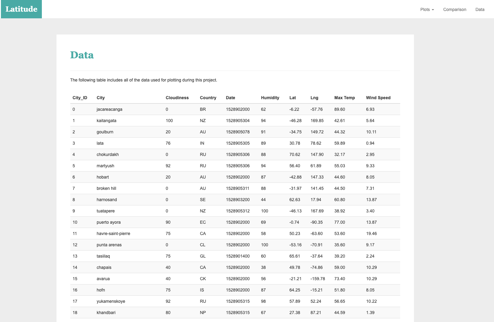
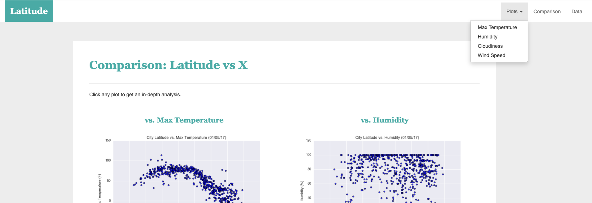

# Web-Design-Challenge - Web Visualization Dashboard (Latitude)  
 **Submitted By:** Saloni Gupta\
_Date_: december, 12th, 2020 

Web Visualization Dashboard (Latitude)  

 
## Background
Whether you are managing one website or hundreds for yourself or your clients, one thing is for certain. There are a lot of analytics out there that you must review to ensure that it looks good, and interactive. But the last thing any busy professional wants to do is log in from one tool to the next to see the data they need. Fortunately, a dashboard is the answer. In this project, we’re going to look at how you can create an effective analytics dashboard that will cut down the time you spend getting to your analytics, giving you more time to actually review your data.

## Latitude - Latitude Analysis Dashboard with Latitude
Created a visualization dashboard website for previous project work, specifically, we'll be plotting [Weather data](./Resources/cities.csv), and the original GitHub respository found here [python-api-challenge](https://github.com/SaloniGupta1201/Python-API-Challenge).

In building this dashboard, I created individual pages for each plot and a means by which we can navigate between them. These pages will contain the visualizations and their corresponding explanations. I created also a landing page, a page where we can see a comparison of all of the plots, and another page where we can view the data used to build them.
Please visit the website: [Web Visualization Dashboard - by Saloni Gupta](https://salonigupta1201.github.io/Web-Design-Challenge/)

## Website Contents
The website consist of 7 pages total, including:

## 1. Landing page
- Containing an explanation of the project.  
- Links to each visualizations page. There is a sidebar containing preview images of each plot, and clicking an image will take to that visualization.  
The view looks as follows:  

Large screen:  

Small screen:  

## 2. Four visualization pages
- With a descriptive title and heading tag.
- The plot/visualization itself for the selected comparison. 
- A paragraph describing the plot and its significance.  
Large screen:  

Small screen:  

 

## 3. Comparisons page
- Contains all of the visualizations on the same page so we can easily visually compare them.
- Used a Bootstrap grid for the visualizations.
- The grid has two visualizations across on screens medium and larger, and 1 across on extra-small and small screens.  
Large screen:  

   

Small screen:   

   

## 4. Data page
In the data page, displayed a responsive table containing the data used in the visualizations.
The table is constructed by using a bootstrap table component.
The data come from exporting the .csv file as HTML.  

Large screen:  

  

Small screen:  

  

Note:- The website is at the top of every page, and have a navigation menu for plots, comparison, Data, and My page (Portfolio page)

- Has the name of the site on the left of the nav which allows users to return to the landing page from any page.
- A dropdown menu created on the right of the navbar named "Plots" that provides a link to each individual visualization page.
- Provided two more text links on the right: "Comparisons," which links to the comparisons page, and "Data," which links to the data page.
- A responsive navigation menu created by using media queries, and the background color will also change when it goes from large to small page.  

Large screen:  

Small screen:  

  
